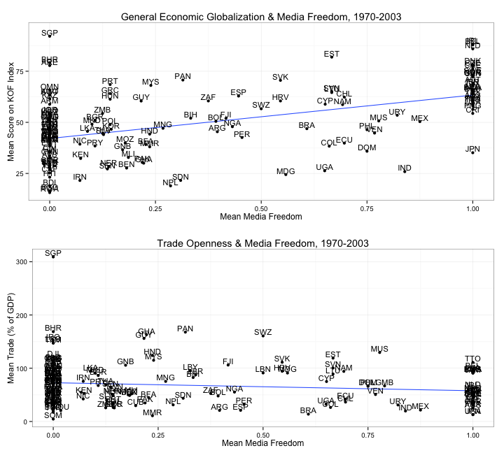
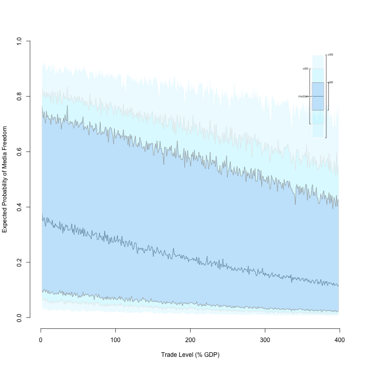
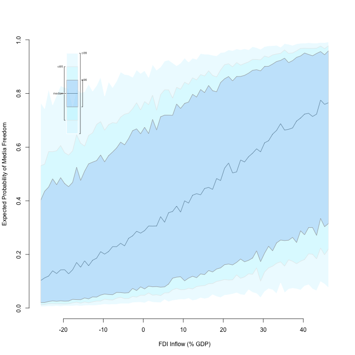
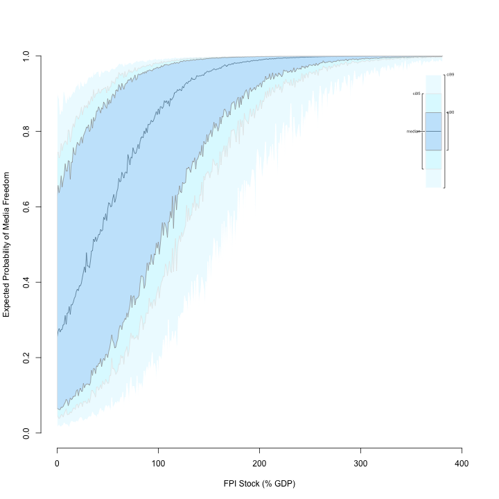
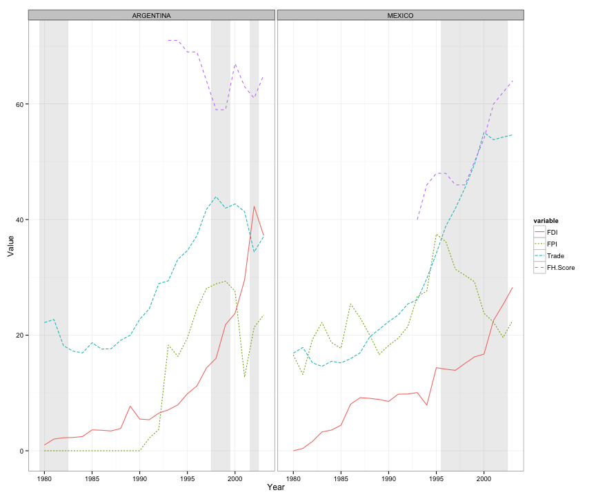

Why are More Trade-Open Countries More Likely to Repress the Media?
========================================================
author: Justin Murphy, University of Southampton
date: April 15, 2014
transition: rotate   

Website: jmrphy.net   
Email: j.murphy@soton.ac.uk   
Twitter: @jmrphy   

Roadmap
========================================================
1. The Puzzle

2. A Theory

3. Research Strategy

4. Quantitive findings

5. Qualitative findings

6. Conclusion

The Puzzle
========================================================

A Theory
========================================================
incremental: true

- Increases in overall globalization should increase the probability of media repression.
    - Domestic backlash can threaten incumbent governments.
    - Tactics of media repression are attractive for managing this backlash.
- However, foreign investors have a stake in transparency, so FDI and FPI should decrease media repression.
- Unique about international trade is that foreign importers/exporters have no such stake in transparency.
- Thus, FDI and FPI should *correct* the repressive tendency while trade *enables* the continuation of repression.

Research Strategy
========================================================
incremental: true

A mixed-methods design combining large-N statistical analysis and qualitative process-tracing.
  - State-level statistical analysis of a large panel of countries from 1970 to 2003 (Sorens and Ruger 2012; Freedom House; Van Belle 2000).
  - Brief case studies of Argentina and Mexico in the early 1990s.
  
Quantitative Findings
========================================================
type: prompt
incremental: true

We can visualize how globalization shapes the expected probability of observing media freedom.

Under the hood of the following slides:
  - Logistic regressions for a binary dependent variable (media freedom).
  - Controlling for:
    - Level of democracy
    - Change in democracy
    - GDP per capita
    - Growth in GDP per capita
    - The other components of globalization

The Effect of Trade Openness on Probability of Media Freedom
========================================================
title: false

The Effect of FDI Inflows on Probability of Media Freedom
========================================================
title: false

    
The Effect of FPI Stocks on Probability of Media Freedom
========================================================
title: false

Qualitative Findings
========================================================
type: prompt
incremental: true

We can trace the hypothesized process in Argentina and Mexico in the early 1990s.

  - Relatively hard tests because they're consolidating democracies
  
  - Substantively and historically important cases because they were poster-children of the "Washington consensus"

========================================================
title: false

Thank you!
=========================================================
type: prompt

The paper and these slides are available from my website.

- Website: jmrphy.net   
- Email: j.murphy@soton.ac.uk   
- Twitter: @jmrphy   
